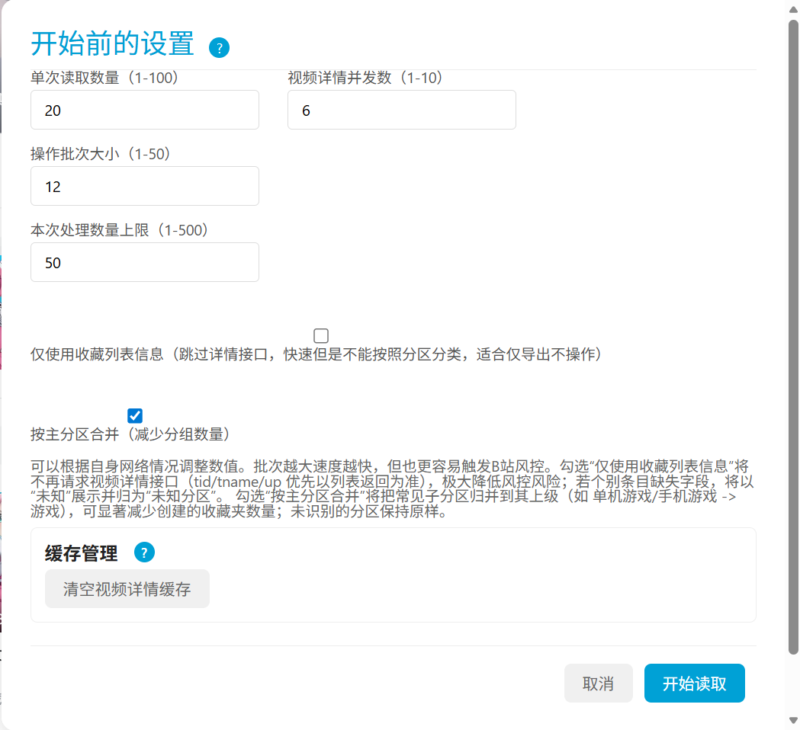
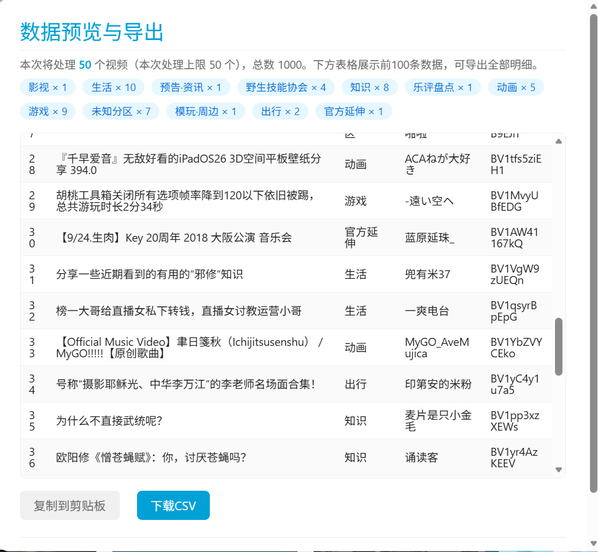
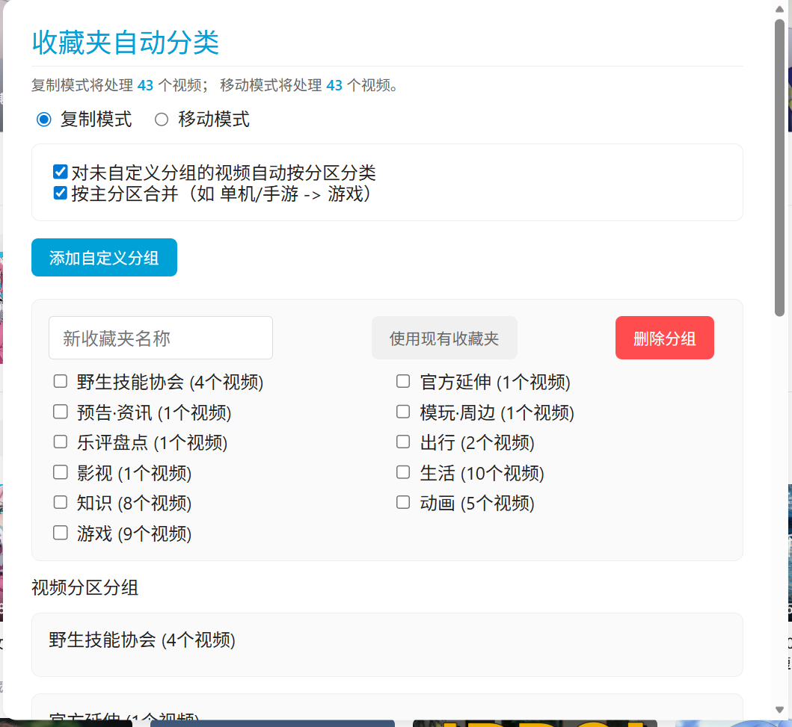

### **Bilibili收藏夹自动分类**  

## **简介**  

Tampermonkey 脚本：按“分区/主分区”批量分类收藏夹视频，支持复制/移动、自定义分组、主分区合并、预览导出、分批与区间处理、详情缓存与清理、失败降级重试与备份。  

## **功能概览**  

- 读取收藏夹：进度条、可暂停/继续，设置“本次处理上限”，支持“继续分析剩余”  
- 详情获取可选：默认获取视频详情以显示分区；也可勾选“仅使用收藏列表信息”跳过详情以更快更稳（适合仅导出不分类）  
- 分区合并：支持按“主分区”聚合（如 单机/手游 → 游戏），减少目标收藏夹数量  
- 预览与导出：支持文本复制与 CSV 下载，摘要展示各分区数量  
- 自定义区间：仅在复制模式下生效，可选择序号区间分批复制处理  
- 自定义分组与沿用现有收藏夹：勾选若干分区合并到指定收藏夹；填写现有收藏夹名称会直接复用，未命名则自动创建并避免重名  
- 批量复制/移动：使用 B 站官方接口（/x/v3/fav/resource/copy|move），自动去重并自适应拆分为小批；失败降级到逐条，批间抖动冷却  
- 一键备份：将当前收藏夹整体复制到新建备份夹，避免误操作  
- 详情缓存与清理：缓存视频分区/UP 信息以减少重复请求，提供“清空缓存”按钮（不缓存“未知分区”占位）  
- 日志与错误提示：F12 控制台输出调试信息，自动跳过失效视频并统计  

## **操作阶段截图**  
1. 开始前的设置（参数、跳过详情、主分区合并、缓存清理）  
  
2. 读取完成 - 下一步操作（处理上限、自定义区间、备份）  
  
3. 数据预览与导出（分区摘要、前100条、支持复制或 CSV 下载导出）  
  
4. 自动分类操作（复制/移动、自定义分组、主分区切换、使用现有收藏夹）  
  

## 安装方法与快速开始  
1. 安装 Tampermonkey：访问 [Tampermonkey 官网](https://www.tampermonkey.net/) 安装浏览器扩展。  
2. 获取脚本：
   - GitHub 原始脚本：[点此查看](https://github.com/jqwgt/bilibili-favlist-classifier/blob/main/%E6%94%B6%E8%97%8F%E5%88%86%E7%B1%BB/Bilibili%E6%94%B6%E8%97%8F%E5%A4%B9%E8%87%AA%E5%8A%A8%E5%88%86%E7%B1%BB.js)
   - Greasyfork 安装页：[点此安装](https://greasyfork.org/zh-CN/scripts/531672-bilibili%E6%94%B6%E8%97%8F%E5%A4%B9%E8%87%AA%E5%8A%A8%E5%88%86%E7%B1%BB)
3. 在收藏夹页面 `https://space.bilibili.com/你的UID/favlist` 右下角点击“按分区分类”开始。  
4. 按截图依次完成【开始前的设置 → 读取完成下一步 → 预览导出 → 分类操作】。  
5. 分类完成后刷新页面核对结果；建议先备份再批量移动。  

## 使用流程摘要  
1. 开始前的设置：决定读取策略与是否跳过详情。  
2. 读取完成：设定本次处理上限、可选区间、可执行备份。  
3. 数据预览与导出：核对分区统计，决定是否继续分类。  
4. 自动分类操作：配置模式（复制/移动）、自定义分组及主分区合并。  
5. 执行分类：批量接口提交，自适应拆分；完成后可继续下一批或结束。  
- 对于收藏夹内的失效视频或受限内容，脚本会自动跳过并在日志提示  
- 请确保已登录并拥有操作该收藏夹的权限  
- 日志信息输出在浏览器开发者工具(F12)控制台，便于调试  
- 接口存在限流与风控，若失败可稍后重试；脚本内置重试、抖动与分批降级  
- 若预览里分区大面积为“未知”，请关闭“仅使用收藏列表信息”并重试；必要时在初始设置中清空缓存  

## **推荐使用方法**  

- 风控友好参数：单次读取建议≤50；操作批次适中（默认 12）；详情并发按网络状况 2-6 之间即可。遇到频繁失败可调小参数并分批多次执行。  
- 仅导出不分类：勾选“仅使用收藏列表信息”，直接预览并导出数据。  
- 主分区合并：默认开启，建议保留，可显著减少创建的收藏夹数量。  
- 大量视频分批处理：
  - 方案 A（移动模式多次出栈，推荐简单稳妥）：不勾选“对未自定义分组的视频自动按分区分类”，切换到“移动模式”。这样每次只会把你在“自定义分组”里选中的那部分视频从当前收藏夹移走，反复多次直到全部处理完成。
  - 方案 B（复制模式按区间分次）：在“读取完成”页面勾选“启用自定义处理区间（仅复制模式）”，按区间多次复制到目标，再视需要手动清理源收藏夹。  
- 执行前可先用“一键备份当前收藏夹”生成备份，避免误操作。  

## **与历史版本的差异概览（v2.0）**

- 新增“开始前设置”面板：读取页大小、详情并发、批次大小、处理上限、是否跳过详情、是否按主分区合并、清空缓存  
- 新增“读取完成”面板：设置本次处理上限、启用自定义区间（仅复制）、一键备份  
- 新增“数据预览与导出”：摘要分区统计、表格预览、复制文本/下载 CSV  
- 新增“主分区”聚合与 UI 切换；分组与导出可使用主分区名  
- 使用官方批量复制/移动接口（resources="aid:2"），自适应整批→二分→单条，批间抖动降风控  
- 强化缓存：仅在拿到有效 tid+tname 时写入，不缓存“未知分区”；提供清空按钮  
- 读取阶段支持暂停/继续与“继续分析剩余”，并在达到“处理上限”后主动停读  
- 自动跳过失效视频；重名收藏夹自动添加序号后缀  
## **注意事项**  

- **对于收藏夹内的失效视频或者官方的电影/综艺视频，会自动跳过并在日志提示**  
- 请确保 **已登录B站账号**，并且 **具有操作当前收藏夹的权限**。  
- **日志信息** 会输出在 **浏览器开发者工具 (F12) 控制台**，方便调试和查看进度。  
- **由于B站API的限制**，获取视频信息可能会有 **一定的延迟**，请耐心等待。  
- **出现错误时**，请尝试刷新页面后重试。  

## **开发者**  

- [我的 GitHub](https://github.com/jqwgt)  
- [我的 B站空间](https://space.bilibili.com/1937042029)
  
## Star History

## **许可证**  

本项目遵循 **GPL-3.0** 开源协议。  

