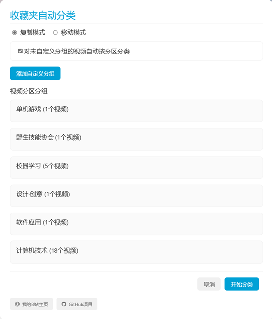
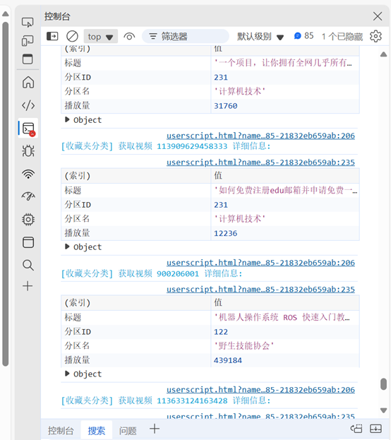

### **Bilibili收藏夹自动分类**  

## **简介**  

这是一个用于自动分类B站收藏夹视频的Tampermonkey脚本。该脚本会根据视频的分区自动将视频分类到不同的收藏夹中，并在页面右侧显示读取视频的进度。  

## **功能**  

- **自动获取** B站收藏夹中的视频  
- **根据视频分区** 自动分类视频到不同的收藏夹  
- **支持移动和复制** 两种模式  
- **支持自定义分组** 和使用现有收藏夹  
- **可选自动分类** 未自定义分组的视频（按分区分类）  
- **在页面右侧显示进度**，可按 **F12** 在开发者工具终端查看详细日志  
  
  

以下是整理好的安装方法：

## 安装方法

1. **安装 Tampermonkey 插件**
   - 访问 [Tampermonkey 官方网站](https://www.tampermonkey.net/) 并按照提示安装适用于您浏览器的版本。

2. **获取脚本代码**
   - 方法一：点击 [此处](https://github.com/jqwgt/bilibili-favlist-classifier/blob/main/Bilibili%E6%94%B6%E8%97%8F%E5%A4%B9%E8%87%AA%E5%8A%A8%E5%88%86%E7%B1%BB.js) 获取脚本代码。
   - 方法二：访问 [Greasyfork](https://greasyfork.org/zh-CN/scripts/531672-bilibili%E6%94%B6%E8%97%8F%E5%A4%B9%E8%87%AA%E5%8A%A8%E5%88%86%E7%B1%BB) 页面并直接安装脚本。
   - 方法三：待 Edge 扩展商店审核通过后，可以从商店直接安装。

3. **在 Tampermonkey 内安装脚本**
   - 如果您选择了方法一，请将复制的脚本代码粘贴到 Tampermonkey 的“添加新脚本”界面中，然后保存即可。

## **使用方法**  

1. **打开B站收藏夹页面**（例如 `https://space.bilibili.com/你的UID/favlist`）。  
2. **点击“按分区分类”按钮**，该按钮会出现在页面右下角。  
3. 在弹出的 **配置界面** 中，您可以：  
   - **选择移动或复制模式**。  
   - **添加自定义分组** 或使用现有收藏夹。  
   - **启用自动分类**（对未自定义分组的视频按照分区信息进行分类）。  
4. **点击“开始分类”**，脚本会自动创建需要的收藏夹，并将视频分类到对应的收藏夹中。  

## **注意事项**  

- **运行前请先清理收藏夹内的失效视频，否则会报错！！！**  
- 请确保 **已登录B站账号**，并且 **具有操作当前收藏夹的权限**。  
- **日志信息** 会输出在 **浏览器开发者工具 (F12) 控制台**，方便调试和查看进度。  
- **由于B站API的限制**，获取视频信息可能会有 **一定的延迟**，请耐心等待。  
- **出现错误时**，请尝试刷新页面后重试。  

## **开发者**  

- [我的 GitHub](https://github.com/jqwgt)  
- [我的 B站空间](https://space.bilibili.com/1937042029)  

## **许可证**  

本项目遵循 **GPL-3.0** 开源协议。  

### **优化安装方法**  

您可以通过以下方式安装脚本：  
- **复制代码** 到 Tampermonkey 的 **“添加新脚本”** 界面并保存。  
- 直接在 **[Greasyfork](https://greasyfork.org/zh-CN/scripts/531672-bilibili%E6%94%B6%E8%97%8F%E5%A4%B9%E8%87%AA%E5%8A%A8%E5%88%86%E7%B1%BB)** 安装。  
- **Edge扩展商店审核通过后**，可直接从商店安装。
